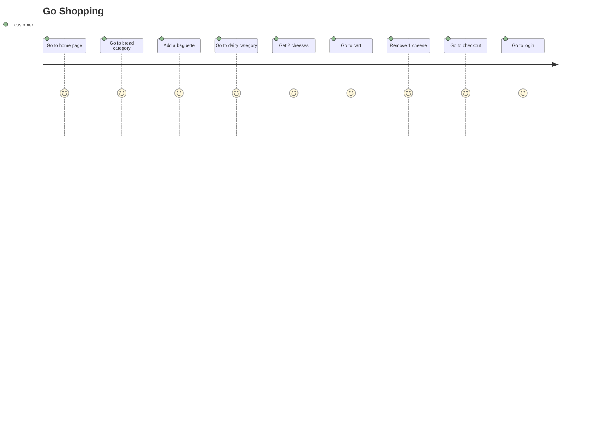

# Page Object Model Learnings

Why use the page object model? Because it makes the tests look pretty. 

Where it started:
```java
package com.sintutu.organicshopuitests;

import static org.junit.jupiter.api.Assertions.assertEquals;

import java.net.URISyntaxException;
import java.net.URL;
import java.nio.file.Paths;
import java.time.Duration;

import org.junit.jupiter.api.Test;
import org.openqa.selenium.By;
import org.openqa.selenium.WebDriver;
import org.openqa.selenium.WebElement;
import org.openqa.selenium.chrome.ChromeDriver;
import org.openqa.selenium.support.ui.ExpectedConditions;
import org.openqa.selenium.support.ui.WebDriverWait;

/**
 * ## What to test

Add an end to end test performing the following:
 
1. Select the Bread Category
2. Assert that the URL has changed
3. Add a French Baguette
4. Select the Dairy Category
5. Assert that the URL has changed
6. Add 2 blocks of cheese
7. Open the cart
8. Assert that the URL has changed
9. Remove one block of cheese
10. Click checkout
11. Click Login
 */
public class EndToEndTests {
    @Test
    public void endToEndTestShouldSucceed() throws URISyntaxException {
        // Set the path to chromedriver
        URL resource = getClass().getClassLoader().getResource("drivers/chromedriver.exe");
        if (resource != null) {
            System.setProperty("webdriver.chrome.driver", Paths.get(resource.toURI()).toString());
        }
        //Create the WebDriver 
        WebDriver driver = new ChromeDriver();

        //Navigate to home page
        driver.get("https://agular-test-shop-cb70d.firebaseapp.com");
        String currentUrl = driver.getCurrentUrl();
        assertEquals("https://agular-test-shop-cb70d.firebaseapp.com/", currentUrl);

        //1. Select the Bread Category
        WebDriverWait wait = new WebDriverWait(driver, Duration.ofSeconds(10));
        WebElement breadLink = wait.until(ExpectedConditions.presenceOfElementLocated(By.linkText("Bread")));
        breadLink.click();

        //2. Assert that the URL has changed
        currentUrl = driver.getCurrentUrl();
        assertEquals("https://agular-test-shop-cb70d.firebaseapp.com/?category=bread", currentUrl);

        //3. Add a French Baguette
        WebElement addToCartFreshFrenchBaguette 
        = wait.until(ExpectedConditions.presenceOfElementLocated(
            By.xpath(
                "//product-card[.//h5[contains(text(), 'Fresh French Baguette')]]//button[contains(text(), 'Add to Cart')]"
                )));
        addToCartFreshFrenchBaguette.click();

        // 4. Select the Dairy Category
        WebElement dairyLink = wait.until(ExpectedConditions.presenceOfElementLocated(By.linkText("Dairy")));
        dairyLink.click();
        
        // 5. Assert that the URL has changed
        currentUrl = driver.getCurrentUrl();
        assertEquals("https://agular-test-shop-cb70d.firebaseapp.com/?category=dairy", currentUrl);

        // 6. Add 2 blocks of cheese
        WebElement addToCartCheese 
        = wait.until(ExpectedConditions.presenceOfElementLocated(
            By.xpath(
                "//product-card[.//h5[contains(text(), 'Cheese')]]//button[contains(text(), 'Add to Cart')]"
                )));
        addToCartCheese.click();

        WebElement addOneMoreToCartCheese
        = wait.until(ExpectedConditions.presenceOfElementLocated(
            By.xpath(
                "//product-card[.//h5[contains(text(), 'Cheese')]]//button[contains(text(), '+')]"
                )));
        addOneMoreToCartCheese.click();

        // 7. Open the cart
        WebElement shoppingCartLink = wait.until(ExpectedConditions.presenceOfElementLocated(By.partialLinkText("Shopping Cart")));
        shoppingCartLink.click();

        // 8. Assert that the URL has changed
        currentUrl = driver.getCurrentUrl();
        assertEquals("https://agular-test-shop-cb70d.firebaseapp.com/shopping-cart", currentUrl);        

        // 9. Remove one block of cheese
        WebElement removeOneMoreFromCartCheese
        = wait.until(ExpectedConditions.presenceOfElementLocated(
            By.xpath(
"//table//tr[td[normalize-space(text()) = 'Cheese']]//button[normalize-space(text()) = '-']"                )));
        removeOneMoreFromCartCheese.click();

        // 10. Click checkout
        WebElement checkOutLink = wait.until(ExpectedConditions.presenceOfElementLocated(By.partialLinkText("Check Out")));
        checkOutLink.click();

        // 11. Click Login
        WebElement loginLink = wait.until(ExpectedConditions.presenceOfElementLocated(By.linkText("Login")));
        loginLink.click();

        //Drop the driver
        driver.quit();
    }
}
```

Where it is now:

```java
package com.sintutu.organicshopuitests.utils;

import java.net.URISyntaxException;
import java.net.URL;
import java.nio.file.Paths;
import java.time.Duration;

import org.junit.jupiter.api.AfterEach;
import org.junit.jupiter.api.BeforeEach;
import org.openqa.selenium.By;
import org.openqa.selenium.WebDriver;
import org.openqa.selenium.WebElement;
import org.openqa.selenium.chrome.ChromeDriver;
import org.openqa.selenium.support.ui.ExpectedConditions;
import org.openqa.selenium.support.ui.WebDriverWait;

import com.sintutu.organicshopuitests.pages.BreadPage;
import com.sintutu.organicshopuitests.pages.DairyPage;
import com.sintutu.organicshopuitests.pages.HomePage;
import com.sintutu.organicshopuitests.pages.LoginPage;
import com.sintutu.organicshopuitests.pages.ShoppingCartPage;

public abstract class TestBase {
    private WebDriver driver;
    private WebDriverWait wait;
    private PageFactory pageFactory;

    // Common Locators
    private static final By SHOPPING_CART_LINK = By.partialLinkText("Shopping Cart");
    private static final By LOGIN_LINK = By.linkText("Login");

    // Declare PageObjects
    protected HomePage homePage;
    protected BreadPage breadPage;
    protected DairyPage dairyPage;
    protected ShoppingCartPage shoppingCartPage;
    protected LoginPage loginPage;

    //Create the WebDriver
    @BeforeEach
    private void setUp() throws URISyntaxException {
        URL resource = getClass().getClassLoader().getResource("drivers/chromedriver.exe");
        if (resource != null) {
            System.setProperty("webdriver.chrome.driver", Paths.get(resource.toURI()).toString());
        }
        driver = new ChromeDriver();

        // Create WebDriverWait
        wait = new WebDriverWait(driver, Duration.ofSeconds(10));

        // Initialize PageFactory
        pageFactory = new PageFactory(driver, wait);

        // Initialize PageObjects
        homePage = pageFactory.getHomePage();
        breadPage = pageFactory.getBreadPage();
        dairyPage = pageFactory.getDairyPage();
        shoppingCartPage = pageFactory.getShoppingCartPage();
        loginPage = pageFactory.getLoginPage();
    }

    protected void clickShoppingCartLink(){
        WebElement shoppingCartLink = wait.until(ExpectedConditions.elementToBeClickable(SHOPPING_CART_LINK));
        shoppingCartLink.click();
    }

    protected void clickLoginLink(){
        WebElement loginLink = wait.until(ExpectedConditions.elementToBeClickable(LOGIN_LINK));
        loginLink.click();
    }

    @AfterEach
    private void tearDown(){
        if (driver != null) {
            driver.quit();
            driver = null;
        }
    }
}
```

EndToEndTests.java looks so elegant. 

## Tests focus on user journey

It reads like someone is opening up Google Chrome and going shopping.



These tests say pretty much what's in that journey. **These tests don't show how this journey is implemented.** 

The home page is abstracted into a `homepage` object. The type isn't visible in the tests. The test does reveal the ability to `load()`, check I'm on the right home page with the `assertHomePageIsLoaded()`, go to the bread category with `clickBreadLink()` and the dairy category with `clickDairyLink()`. It mimics how a human being would interact with the browser to go shopping. This abstraction allows focusing on the actions.

How `homePage` even appears comes from `EndToEndTests` inheriting from `TestBase`.

<div class="design-decision">
<h5>Violating Open-Closed Principle is a design decision</h5>
<p>
Keeping implementation out of the tests means, if there were more tests then these should sit in `EndToEndTests`. If these tests are on new pages, this means `TestBase` must be modified. `TestBase` is by design not closed to modification.
</p>
</div>
<br/>

---

## What `TestBase` does

### Information Hiding

Every object and method with the `protected` access modifier is one `EndToEndTests` uses. When in `EndToEndTests` the intellisense or LSP won't pick up the `private` stuff.

```java
package com.sintutu.organicshopuitests.utils;

import java.net.URISyntaxException;
import java.net.URL;
import java.nio.file.Paths;
import java.time.Duration;

import org.junit.jupiter.api.AfterEach;
import org.junit.jupiter.api.BeforeEach;
import org.openqa.selenium.By;
import org.openqa.selenium.WebDriver;
import org.openqa.selenium.WebElement;
import org.openqa.selenium.chrome.ChromeDriver;
import org.openqa.selenium.support.ui.ExpectedConditions;
import org.openqa.selenium.support.ui.WebDriverWait;

import com.sintutu.organicshopuitests.pages.BreadPage;
import com.sintutu.organicshopuitests.pages.DairyPage;
import com.sintutu.organicshopuitests.pages.HomePage;
import com.sintutu.organicshopuitests.pages.LoginPage;
import com.sintutu.organicshopuitests.pages.ShoppingCartPage;

public abstract class TestBase {
    private WebDriver driver;
    private WebDriverWait wait;
    private PageFactory pageFactory;

    // Common Locators
    private static final By SHOPPING_CART_LINK = By.partialLinkText("Shopping Cart");
    private static final By LOGIN_LINK = By.linkText("Login");

    // Declare PageObjects
    protected HomePage homePage;
    protected BreadPage breadPage;
    protected DairyPage dairyPage;
    protected ShoppingCartPage shoppingCartPage;
    protected LoginPage loginPage;

    //Create the WebDriver
    @BeforeEach
    private void setUp() throws URISyntaxException {
        URL resource = getClass().getClassLoader().getResource("drivers/chromedriver.exe");
        if (resource != null) {
            System.setProperty("webdriver.chrome.driver", Paths.get(resource.toURI()).toString());
        }
        driver = new ChromeDriver();

        // Create WebDriverWait
        wait = new WebDriverWait(driver, Duration.ofSeconds(10));

        // Initialize PageFactory
        pageFactory = new PageFactory(driver, wait);

        // Initialize PageObjects
        homePage = pageFactory.getHomePage();
        breadPage = pageFactory.getBreadPage();
        dairyPage = pageFactory.getDairyPage();
        shoppingCartPage = pageFactory.getShoppingCartPage();
        loginPage = pageFactory.getLoginPage();
    }

    protected void clickShoppingCartLink(){
        WebElement shoppingCartLink = wait.until(ExpectedConditions.elementToBeClickable(SHOPPING_CART_LINK));
        shoppingCartLink.click();
    }

    protected void clickLoginLink(){
        WebElement loginLink = wait.until(ExpectedConditions.elementToBeClickable(LOGIN_LINK));
        loginLink.click();
    }

    @AfterEach
    private void tearDown(){
        if (driver != null) {
            driver.quit();
            driver = null;
        }
    }
}
```

### `TestBase` is responsible for too much stuff
`TestBase` is responsible for:
* Providing the methods and objects the tests use.
* Environment setup e.g. reading where the driver is and loading it.

This is a violation of the Single Responsibility Principle. 

<div class="recommendation-box">
Separate these responsibilities.The driver setup is complicated and can be implemented in a different class, say <code>DriverFactory</code>. Page objects are already handled well enough by the <code>PageFactory</code>.
</div><br/>

### `TestBase` is tightly coupled to Selenium's `WebDriver` class

There will come a time to use different class. Or a different browser's driver. Woudn't it be nice to inject a dependency rather than have Selenium's `WebDriver` tightly coupled to `TestBase`? Yes. 

Another tight coupling is how the page objects use this driver because `PageFactory` uses this driver. Each page object expects precisely Selenium's `WebDriver`. For example:
```java
import org.openqa.selenium.By;
import org.openqa.selenium.WebDriver;
import org.openqa.selenium.support.ui.ExpectedConditions;
import org.openqa.selenium.support.ui.WebDriverWait;

import com.sintutu.organicshopuitests.utils.ConfigReader;

public class LoginPage {
    private WebDriver driver;
    private WebDriverWait wait;
    // Locators
    private static final By LOGIN_WITH_GOOGLE_BUTTON =  By.xpath("//button[normalize-space(text()) = 'Login with Google']");

    // Constructor
    public LoginPage(WebDriver driver, WebDriverWait wait) {
        this.driver = driver;
        this.wait = wait;      
    }
    ///code goes on...
```


The Dependency Inversion Principle suggests to abstract the particular class of driver used by using an interface. 

<div class="recommendation-box">
<h5>Use a <code>Driver</code> interface</h5>
Create a <code>public interface Driver</code> then substitute <code>public WebDriver driver</code> for <code>public Driver driver</code>.
</div><br/>

### Holds common locators

Login appears on every page the test sees. So it's common at this time. `TestBase` is where it makes the most sense to put it for now. It would be overengineering to create a separate object or file. I'll come back to this after looking at other parts.

### Revisiting `TestBase`'s responsibilities

1. `TestBase` needs to provide the pages and actions on the pages to `EndToEndTests`.
    1. The way is to make identifiers for pages and actions and use the `protected` access modifier to make these usable in `EndToEndTests`.
    2. The implementation to make these pages and actions available is hidden from `EndToEndTests`.
2. `TestBase` creates objects necessary to provide the pages and actions available. The pages are instances of page objects. The actions are methods defined inside `TestBase` or objects created inside `TestBase`. 
    1. The `WebDriver`, `WebDriverWait` and `PageFactory` are declared as private variables `driver`, `wait` and `pageFactory` at the very top of the class.
    2. Creating the objects is done by instantiating them with the `setup()` method. 
        1. The `WebDriver`, `WebDriverWait` and `PageFactory` instances are instantiated in the `setUp` method. 
        2.  There's this cascade where `wait` needs `driver` to be instantiated, and `pageFactory` needs `driver` and `wait` to be instantiated.
        3. I unwittingly tightly coupled `pageFactory` to a `WebDriver` when I created the class.
    3. The page objects `homePage`, `breadPage`, `dairyPage`, `shoppingCartPage` and `loginPage` are 
        1. declared in `TestBase`
        2. instantiated by `TestBase`'s using the `pageFactory` instance.
        3. `pageFactory` takes care of implementing these. `TestBase` has a `PageFactory` and by composition `pageFactory` provides the easy methods  `getHomePage()`, `getBreadPage()`, `getDairyPage()`, `getShoppingCartPage()` and `getLoginPage()`.
3. `TestBase` also disposes of the driver in the `tearDown()` method.
4. `TestBase` invokes the `setUp()` and `tearDown()` methods with a test run because the `@BeforeEach` and `@AfterEach` are associated with them respectively. `mvn test` is using junit and `EndToEndTests` has method `public void windowShoppingShouldSucceed()` with the `@Test` annotation. So before that test runs it calls the methods in the package with the `@BeforeEach` and `@AfterEach` annotations. So `TestBase` will create new `driver`, `wait` and `pageFactory` for every method in `EndToEndTests` with the `@Test` annotation and dispose of the driver at the end of each test.

Why is `TestBase` creating a new one of these for each test? I asked Copilot. Apparently it's best practice. It helps with test isolation and avoids flakiness.

>**1. Why Create a New `WebDriver` Per Test?**
>Creating a fresh `WebDriver` instance per test is a common practice in UI test automation. Here’s why:
>
>**Test Isolation**: Each test should ideally run in a clean state, unaffected by other tests. Reusing the same `WebDriver` across tests could lead to state leakage (e.g., open browser tabs, lingering cookies, or corrupted test data).
>
>**Parallel Execution**: If you decide to run tests in parallel in the future, each test will need its own WebDriver instance to avoid conflicts.
>
>However, this practice comes with overhead—starting and stopping a browser for every test is resource-intensive and slows down the test suite.
>
>**2. Why Create `WebDriverWait` and `PageFactory` Per Test?**
>Here’s the current behavior:
>
>`WebDriverWait`: This class depends on the `WebDriver` instance. Since a new `WebDriver` is created per test, you need a new `WebDriverWait` as well to properly reference the new driver.
>
>`PageFactory`: Similarly, the `PageFactory` needs to be tied to the `WebDriver` and `WebDriverWait` instances, so it is recreated each time.
>
>Creating these objects multiple times isn’t inherently bad because they’re lightweight. However, if the logic for initializing them can be centralized and shared, you might simplify the code.
>
>**3. Why Dispose of the Driver After Each Test?**
>As mentioned, this is about test isolation. Quitting the driver ensures:
>
>The browser closes, clearing all state (cookies, session storage, etc.).
>
>Resources are freed properly, avoiding potential memory leaks.
>
>If you reuse the same `WebDriver` instance across tests:
>
>**Pros**: Tests will execute faster since there’s no browser setup overhead.
>
>**Cons**: You risk state leakage between tests, which can lead to flaky or unreliable tests.

I even asked for an example of flakiness that comes with using the same instance across tests.

>```java
>@Test
>public void testA() {
>    driver.get("https://example.com/login");
>    driver.findElement(By.id("username")).sendKeys("userA");
>    driver.findElement(By.id("password")).sendKeys("passwordA");
>    driver.findElement(By.id("login")).click();
>    assertEquals("https://example.com/dashboard", driver.getCurrentUrl());
>}
>
>@Test
>public void testB() {
>    driver.get("https://example.com/login");
>    driver.findElement(By.id("username")).sendKeys("userB");
>    driver.findElement(By.id("password")).sendKeys("passwordB");
>    driver.findElement(By.id("login")).click();
>    assertEquals("https://example.com/dashboard", driver.getCurrentUrl());
>}
>```
>**Problem**: If `testA` leaves the browser logged in, `testB` might fail because it doesn’t start on the login page.

---

## Implementing Page Objects

What is a page object's responsibility?

To have a representation of the elements of the page in code.

As a class, what I've implemented has satisfied the single responsibility principle. In the example below, `BreadPage` 
1. There's a constructor to create the page object.
2. There are locators relevant to a `BreadPage` instance
3. There are methods to interact with the locator.

```java
package com.sintutu.organicshopuitests.pages;

import static org.junit.jupiter.api.Assertions.assertEquals;

import org.openqa.selenium.By;
import org.openqa.selenium.WebDriver;
import org.openqa.selenium.WebElement;
import org.openqa.selenium.support.ui.ExpectedConditions;
import org.openqa.selenium.support.ui.WebDriverWait;

import com.sintutu.organicshopuitests.utils.ConfigReader;

public class BreadPage { 
    private WebDriver driver;
    private WebDriverWait wait;
    // Locators
    private static final By ADD_FRENCH_BAGUETTE_TO_CART = By.xpath("//product-card[.//h5[contains(text(), 'Fresh French Baguette')]]//button[contains(text(), 'Add to Cart')]");

    // Constructor
    public BreadPage(WebDriver driver, WebDriverWait wait) {
        this.driver = driver;
        this.wait = wait;      
    }

    // Assert page is loaded
    public void checkBreadCategoryIsLoaded() {
        wait.until(ExpectedConditions.presenceOfElementLocated(ADD_FRENCH_BAGUETTE_TO_CART));  
        String url = driver.getCurrentUrl();
        assertEquals(ConfigReader.getBaseUri()+"?category=bread", url, "Bread Category did not load as expected.");
    }

    public void addFrenchBaguetteToCart() {
        WebElement addFrenchBaguetteToCartButton = wait.until(ExpectedConditions.elementToBeClickable(ADD_FRENCH_BAGUETTE_TO_CART));  
        addFrenchBaguetteToCartButton.click();
    }
}
```

Is it good work? Looks like it. The page object provides all that's necessary to find stuff on the page and interact with it.

Here are some notable comments from copilot.

First the strengths.

>### Strengths
>#### Encapsulation of Page-Specific Logic:
>
>The class encapsulates all the logic and locators specific to the "Bread" page. This aligns with the principles of the Page Object Model (POM) by providing a clear and reusable abstraction for interacting with this page.
>
>#### Clear Method Names:
>
>The methods, such as `checkBreadCategoryIsLoaded()` and `addFrenchBaguetteToCart()`, are **well-named** and **expressive**. *They clearly indicate what each method does, improving readability and maintainability.*
>
>#### Use of Static Final Locators:
>
>The locator for the "Add French Baguette to Cart" button is appropriately defined as `private static final`, which ensures that it is **immutable** and *tied to the class rather than instances*. This is efficient and aligns with best practices.
>
>#### Assertion Logic within Page Class:
>
>The `checkBreadCategoryIsLoaded()` method includes an assertion to verify that the correct URL is loaded. This is useful for ensuring that the page is in the expected state.

Then the weaknesses.

>### Weaknesses & Suggestions for Improvement
>#### Dependency on `WebDriver`:
>
>**Issue**: The constructor takes `WebDriver` and `WebDriverWait` directly, **coupling the page class to Selenium’s API**.
>```java
>public class BreadPage { 
>    private WebDriver driver;
>    private WebDriverWait wait;
>    // Other code
>
>    // Constructor
>    public BreadPage(WebDriver driver, WebDriverWait wait) {
>        this.driver = driver;
>        this.wait = wait;      
>    }
>    // Code continues
>```
>
>**Solution**: Refactor the class to depend on a Driver abstraction (as discussed earlier). For example:
>
>```java
>public class BreadPage {
>    private final Driver driver;
>
>    public BreadPage(Driver driver) {
>        this.driver = driver;
>    }
>// more code lower down
>```
<div class="recommendation-box">
Yep. This is a problem and interfaces will need to come in to decouple from Selenium's <code>WebDriver</code> and <code>WebDriverWait</code>. A big lesson here is how tight coupling cascades from <code>TestBase</code> to page objects like <code>BreadPage</code>. Modifying code is going to affect a lot of stuff.
</div><br/>

>### Hardcoding Locators:
>
>**Issue**: The locator for the "Add French Baguette to Cart" button is hardcoded into the class. While this works for now, it could be challenging to maintain if locator strategies change or if the button’s behavior needs localization.
>```java
>public class BreadPage { 
>    // Other code
>    private static final By ADD_FRENCH_BAGUETTE_TO_CART = By.xpath("//product-card[.//h5[contains(text(), 'Fresh French Baguette')]]//button[contains(text(), 'Add to Cart')]");
>    // Other Code
>```
>**Solution**: Externalize locators using a configuration file or constants in a separate class. Alternatively, store reusable locators in centralized utilities.
>
<div class="recommendation-box">
One of the criticisms of <code>TestBase</code> was those locators just hanging around. If I were to put them in to a class along with all locators, this wouldn't be a problem.
</div><br/>
<div class="aside-box">
My best guess for localization problems is that I'm identifying these products in English. Same product in a different language would render different innerText. So I'd need to have that different inner text loded into my locator. And I'd want that logic to load that locator from, say a configuration file, into a `Locator` class depending on the language I'm testing in. I.e. check if the <code>html</code> element has attribute <code>lang="{some language code}"</code> and then populate the locators based on that language. In this scenario it makes sense to put all the locators in one place so the Locator("en") instance and Locator("de") instance log the English and German words respectively. It's a clever idea 
</div><br/>
<div class="design-decision">
<h5>Keep locators where they are</h5>
<p>
There are bigger fish to fry and this localization issue isn't even relevant per what I've seen. Why overengineer?
</p>
</div><br/>

>#### Responsibility Overlap:
>
>**Issue**: The `checkBreadCategoryIsLoaded()` method combines two responsibilities: checking the presence of an element and verifying the URL. This violates the Single Responsibility Principle.
>
>**Solution**: Split this into two distinct methods:
>
>`isBreadCategoryElementLoaded()` – Checks the presence of the "Add to Cart" button.
>
>`assertBreadCategoryUrlIsLoaded()` – Verifies the URL matches the expected value.
<div class="design-decision">
<h5>checkBreadCategoryIsLoaded() has two small responsibilities</h5>
The <code>checkBreadCategoryIsLoaded()</code> method combines two responsibilities: checking the presence of an element and verifying the URL. These two responsibilities are just one responsibility to make extra sure the page is loaded. This is achievable in a tiny class. I'm not making new methods to call inside this method just to keep responsibilities segregated. Decision: Keep this method doing one thing well.
</div><br/>

>#### No Handling for Dynamic Waits:
>
>**Issue**: The reliance on `WebDriverWait` assumes static durations for element visibility. If this test scales to complex pages, it could lead to inefficiency or flakiness.
>
>**Solution**: Abstract wait logic into the `Driver` interface so it can adapt dynamically:
>
>```java
>WebElement waitForElement(By locator);
>```
<div class="recommendation-box">
<p>First thought: this recommendation was stupid. It took guesswork to figure out I needed to poll for at least 10 seconds with <code>WebDriverWait</code> to get the tests to work. How do I <em>determine</em> the optimum duration without guesswork? I'd have no problem <em>dynamically</em> updating it if I didn't have to guess.
</p>

<p>
Second thought: the solution isn't even trying to solve that problem. It's actually saying to use an interface, <code>Driver</code> for a driver, which, someday, might solve the problem. This interface contract says method <code>WebElement waitForElement(By locator)</code> must be implemented.
</p>

<p>
I ask if this <code>waitForElement</code> method even exists? It doesn't. I have to make one. I have to make the implementation when I create a class that implements the <code>Driver</code> interface. Below is some sample code:
<br/>
<code>
public class SeleniumDriverManager implements Driver {
    private WebDriver driver;
    private WebDriverWait wait;

    public SeleniumDriverManager() {
        this.driver = new ChromeDriver();
        this.wait = new WebDriverWait(driver, Duration.ofSeconds(10));
    }

    @Override
    public WebElement waitForElement(By locator) {
        return wait.until(ExpectedConditions.presenceOfElementLocated(locator));
    }

    @Override
    public void quitDriver() {
        if (driver != null) {
            driver.quit();
            driver = null;
        }
    }
}
</code>
</p>

<p>
Final thought: this isn't the worst idea. It would be nice to have a <code>waitForLocator</code> method available to my page object classes while the implementation of the logic is abstracted. The criticism of dynamically waiting for load times is unfair.
</p>

I want to do this.
</div><br/>

>#### Potential Tight Coupling to ConfigReader:
>
>**Issue**: The `checkBreadCategoryIsLoaded()` method directly uses `ConfigReader.getBaseUri()` to verify the URL. While this centralizes configuration, it creates a dependency on a utility class.
>```java
>// Assert page is loaded
>    public void checkBreadCategoryIsLoaded() {
>        wait.until(ExpectedConditions.presenceOfElementLocated(ADD_FRENCH_BAGUETTE_TO_CART));  
>        String url = driver.getCurrentUrl();
>        assertEquals(ConfigReader.getBaseUri()+"?category=bread", url, "Bread Category did not load as expected.");
>    }
>```
>**Solution**: Pass the `baseUri` as a parameter or derive it dynamically based on the driver’s navigation context. For example:
>
>```java
>String expectedUri = driver.getBaseUri() + "?category=bread";
>assertEquals(expectedUri, url);
>```
<div class="recommendation-box">
I completely agree that I've tightly coupled the ConfigReader to the page object. I just don't know if I'd want it any other way. I'd actuallly do it the same way and just hide this inside a base class <code>BasePage</code> so <code>protected static final String baseUri = ConfigReader.getBaseUri()</code> is available to all the page object that extend <code>BasePage</code>. 
</div><br/>


>### Opportunities for Future Refinement
>#### Reusable Navigation Methods:
>
>If other page classes also require URL assertions, consider abstracting this logic into a Page base class that BreadPage extends. Example:
>
>```java
>public abstract class Page {
>    protected final Driver driver;
>
>    public Page(Driver driver) {
>        this.driver = driver;
>    }
>
>    protected void assertCurrentUrl(String expectedUrl) {
>        assertEquals(expectedUrl, driver.getCurrentUrl());
>    }
>}
>```
<div class="recommendation-box">
<p>I admit I stole my idea for hiding the baseUri from this. 
</p>

<p>
The idea of a <code>BasePage</code> is much more than hiding baseUri. Every page object ineriting this class would have a <code>private Driver driver</code> that's initialised by calling <code>super(Driver driver)</code>. It's a one line change compared to this.driver = driver;
</p>
The logic to assertCurrentUrl is common in every page. It would be clever make the base class implement it. Then the code can call <code>assertCurrentUrl(driver.getCurrentUrl)</code> where the implementation is actually <code>
protected void assertCurrentUrl(String resourcePath)
{
    assertEquals(baseUri+resourcePath, driver.getCurrentUrl());
}
</code>
Having the driver declared in the base of the page allows it to be called in this method. Having the baseUri defined in this base page allows it to be called. The expected path is "" for the root page, "?category=bread" for the bread page, etc. 
</div><br/>

>#### Handling Page State Dynamically:
>
>As your application grows, the `BreadPage` class could handle different states (e.g., the French Baguette is sold out). Design methods to adapt dynamically:
>
>```java
>public boolean isBaguetteAvailable() {
>    return driver.findElements(ADD_FRENCH_BAGUETTE_TO_CART).size() > 0;
>}
>```
<div class="design-decision">
Nice to have. Not interested at this time. No idea how much stock there is.
</div><br/>

---

## PageFactory critique

I used `PageFactory` to instantiate my page objects. It could have been so much more. I asked for a critique and this is what I got back.

```java
package com.sintutu.organicshopuitests.utils;

import org.openqa.selenium.WebDriver;
import org.openqa.selenium.support.ui.WebDriverWait;

import com.sintutu.organicshopuitests.pages.BreadPage;
import com.sintutu.organicshopuitests.pages.DairyPage;
import com.sintutu.organicshopuitests.pages.HomePage;
import com.sintutu.organicshopuitests.pages.LoginPage;
import com.sintutu.organicshopuitests.pages.ShoppingCartPage;

public class PageFactory {
    private WebDriver driver;
    private WebDriverWait wait;

    private HomePage homePage;
    private BreadPage breadPage;
    private DairyPage dairyPage;
    private ShoppingCartPage shoppingCartPage;
    private LoginPage loginPage;

    public PageFactory(WebDriver driver, WebDriverWait wait) {
        this.driver = driver;
        this.wait = wait;
    }

    public HomePage getHomePage() {
        if (homePage == null) {
            homePage = new HomePage(driver, wait);
        }
        return homePage;
    }

    public BreadPage getBreadPage() {
        if (breadPage == null) {
            breadPage = new BreadPage(driver, wait);
        }
        return breadPage;
    }

    public DairyPage getDairyPage() {
        if (dairyPage == null) {
            dairyPage = new DairyPage(driver, wait);
        }
        return dairyPage;
    }

    public ShoppingCartPage getShoppingCartPage() {
        if (shoppingCartPage == null) {
            shoppingCartPage = new ShoppingCartPage(driver, wait);
        }
        return shoppingCartPage;
    }

    public LoginPage getLoginPage() {
        if (loginPage == null) {
            loginPage = new LoginPage(driver, wait);
        }
        return loginPage;
    }
}
```

>After reviewing your `PageFactory` class, here are some observations and critiques, along with suggestions for improvement:
>
>### **Strengths**
>1. **Lazy Initialization**:
>   - The `PageFactory` uses lazy initialization (e.g., `if (homePage == null)`) to create page objects only when needed, which is memory-efficient.
<div class="recommendation-box">
This is a keeper. Initializing it only when it's needed is super cool. It's a pity the way the tests initialize a page object so far it starts out with null page objects. In cleverer designs I may only need to initialize some of the pages in the test base. Or I may need some tests to terminate before reaching a page. Or I may want to take any instance of an existing page and logout, and perhaps trace if the logout happened across all threads. It's very interesting to consider what we want the state of a gambler to be when they tab away from the curent page or close a tab. It closes a session in some very complicated senses. Lazy Intialiazation would be super useful for these ideas and keeping memory low. What I want to avoid is having memory allocated when there isn't a plan to use it any time soon, e.g. the logoutPage.
</div><br/>

>2. **Encapsulation**:
>   - The class encapsulates the creation and management of page objects, keeping the responsibility centralized.
>
<div class="aside-box">
This is a bit iffy. I want to do the information hiding part (hiding how the page object is created). I'm unsure what is meant by <em>management</em>. If it means I can use this one page class to configure the waits however I want for all the page objects, that's great. I just need more experience on whether this really makes things easier to change in future.
</div><br/>

3. **Simple and Readable**:
>   - The code is clean and easy to follow, with no unnecessary complexity. This is particularly useful for smaller projects.
<div class="aside-box">
Liking the idea of lack of complexity. I'm going to make it more complex because I am going to split creating a page and managing it. This is the flip side of managing all in one place. The responsibility I want to put on one class should be single, not multiple.
</div><br/>


>### **Critiques and Areas for Improvement**
>1. **Tight Coupling with `WebDriver` and `WebDriverWait`**:
>   - The `PageFactory` depends directly on `WebDriver` and `WebDriverWait`. This tight coupling makes the class harder to test in isolation and less flexible for future changes.
>   - **Suggestion**: Introduce an abstraction like a `Driver` interface that `WebDriver` implements. This would allow you to use mocks for testing or switch to other implementations without modifying the `PageFactory`.
<div class="recommendation-box">
It's gonna happen. I'm a bit tired of hearing this over and over. Use a driver interface. I'm going to really monitor how much code churn happened because of this single suggestion from my singlularly bad idea to hardcode the driver.
</div><br/>

>2. **Lack of Flexibility for Additional Page Objects**:
>   - The current design hardcodes methods for specific pages (e.g., `getHomePage`, `getBreadPage`). Adding a new page requires modifying the `PageFactory` class itself.
>   - **Suggestion**: Use a `Map` to store page objects keyed by their class or name. For example:
>     ```java
>     private Map<Class<?>, Object> pageMap = new HashMap<>();
>
>     public <T> T getPage(Class<T> pageClass) {
>         return (T) pageMap.computeIfAbsent(pageClass, cls -> createPage(cls));
>         }
>
>     private <T> T createPage(Class<T> pageClass) {
>         // Logic to instantiate the page object
>         // Use reflection or a factory method
>         return pageClass.getConstructor(WebDriver.class, WebDriverWait.class)
>                        .newInstance(driver, wait);
>     }
>     ```
>     This makes the `PageFactory` more generic and extensible.
><div class="aside-box">
>This idea is complicated. I don't understand Java <code>HashMap</code>s. What makes them so cool? I can see the intent is to make <code>PageFactory</code> responsible only for creating the page classes. And if I create a new page I wouldn't have to modify <code>PageFactory</code> to do it. I don't hate this idea that much. But is it not too early to abstract?</div><br/>
>
>3. **Singleton Management**:
>   - While lazy initialization ensures that each page object is a singleton, this logic is replicated across multiple methods, leading to boilerplate code.
>   - **Suggestion**: Abstract the singleton logic into a helper method or use a `Map`-based approach as described above.
><div class="aside-box">
>I don't quite understand what this means. I know I want to have 
><br/><code>public HomePage getHomePage() {<br/>
>        if (homePage == null) {<br/>
>            homePage = new HomePage(driver, >wait);<br/>
>        }
>        return homePage;
>    }</code>
><br/>Let me take a stab at the <code>Map</code>-based approach.
> Since there's already a <code>pageMap</code> then I have somewhere to search for an initialized Page Object that I'd use. If this doesn't contain an instance of <code>HomePage</code> then that corresponds to <code>homePage == null</code>. Then lazy initialization occurs when <code>computeIfAbsent</code> is called. If there is a <code>HomePage</code> in <code>pageMap</code> then the existing instance of <code>HomePage</code> is returned.<br/>
>I'm assuming this is a singleton. That's no guarantee. I'll have to see it in the code. I will try this. I really do enjoy thinking about management beyond looking at the waiting strategy. The responsibility to manage the instances available as <em>singletons</em> didn't occur to me until this suggestion.  
></div><br/>
>
>4. **No Unit Tests**:
>   - The `PageFactory` doesn’t appear to have any tests verifying its functionality.
>   - **Suggestion**: Write unit tests to ensure each method behaves as expected. Mocks could be used for `WebDriver` and `WebDriverWait` to isolate tests for the `PageFactory`.
><div class="aside-box">
>The question I have in my head is, do I want to write unit tests for my unit test framework? And I got some great answers. For the current state of <code>PageFactory</code> it's not really worth it. But once I implement the <code>HashMap</code> and use reflection I make it harder to understand what the factory is supposed to do and errors aren't discoverable at compile-time, only at run-time. If the method signature changes the compiler won't help. So it's important that the tests exist.
></div><br/>
>
>5. **Potential Thread-Safety Issues**:
>   - If the `PageFactory` were used in a multi-threaded test environment (e.g., parallel test execution), the lazy initialization logic could result in race conditions.
>   - **Suggestion**: Ensure thread safety by synchronizing access to page object creation or using thread-local storage if needed.
><div class="aside-box">
>Since these are singletons, two tests can change the state of each page object. Since I've only got one test, I can't be having parallelism issues. But if I were, I could use <code>ThreadLocal</code> in my <code>TestBase</code> to:
> <br/>* Create a driver e.g. <code>private static ThreadLocal&lt;WebDriver&gt; driver = new ThreadLocal&lt;&gt;();</code><br/>
> * Provide <code>EndToEndTests</code> a <code>protected WebDriver getDriver()</code> method that uses that thread-local instance of the driver. The implementation is simply <code>protected WebDriver getDriver() { return driver.get(); }</code> and the tests can then use the driver.
>The <code>setUp()</code> method (which has the <code>@BeforeEach</code> annotation), can now have a <em>local</em> driver with <code>WebDriver localDriver = new ChromeDriver();</code> and then set the <code>driver</code> available to my tests with <code>driver.set(localDriver);</code>. Then I create <em>thread-local</em> with <code>homePage = new HomePage(getDriver(), getWait());</code>. This <code>getDriver()</code> is the same one accessible to the tests. So in setup, each page object is instantiated with a quick and easy local instance.<br/>Of course, this doesn't stop a <code>PageFactory</code> from being used for the same purpose.
></div><br/>
>
><div class="design-decision">
><h5>Implement Page Object Factory with reflection, threadsafety and unit tests on the factory</h5>
>Having considered the existing PageFactory can be implemented with <code>Map</code> and reflection, and that the behaviour of the reflection can be tested in itself, it's useful to implement. It's definitely overkill given the existing pages few, and few others may exist after signing in with Google, it's worth the practice to refactor generating page objects.
></div><br/>
>
>### **Opportunities for Advanced Design**
>- **Dependency Injection**:
>  - Consider using a dependency injection framework (e.g., Spring, Guice) to manage the lifecycle of `WebDriver`, `WebDriverWait`, and page objects. This approach could reduce boilerplate code and improve flexibility.
>
><div class="design-decision">
>Deferring dependency injection to when I go into Spring. 
></div><br/>
>
>- **Separate Concerns**:
>  - The `PageFactory` class currently handles both page object management and initialization. Splitting these responsibilities into separate classes (e.g., a `PageManager` and a `PageFactory`) might improve clarity and cohesion.
>
><div class="aside-box">
>Okay. So now I have a clearer understanding. <ul><li>A <em>manager</em> is about coordination. It knows which Page Object should be available, when to create it, and whether to cache/reuse an existing one.</li><li>A <em>factory</em> is a design pattern responsible for creating objects. In our case, a PageObjectFactory is supposed to create and return fully usable Page Objects.</li><br/>
>My tests need the page object available. The manager can say when it's available. If the page object isn't available, it's the manager's responsibility to go to the factory to get one.
><br/>
>The criticism is because this class knows too much. It knows:
><ul><li>How to construct the pages.</li>
><li>When to construct them.</li>
><li>Whether to reuse them.</li>
></ul>
>This problem gets really out of hand at scale.
>Because test frameworks scale through people, not just machines.
>
>When:
><ul><li>You're running 300 tests in parallel,</li>
><li>Written by 15 different SDETs,</li>
><li>Who all assumed shoppingCartPage was fresh...</li>
></ul>
>…then who is creating the page, when it's created, and how long it lives — those things matter.
>
>This split lets you:
>
><ul><li>Replace the PageObjectFactory with a mock if needed.</li>
><li>Inject a different PageObjectFactory for mobile vs desktop.</li>
><li>Reset or version-control PageObjects via the Manager.</li></ul>
></div><br/>
><div class="design-decision">
><h5>Implement the manager</h5>
><h6>Make the page manager a dumb cache without reflection. Keep reflection only in the factory. Update framework readme to say you use the manager in a specific way.</h6>
>**Below is a question I asked of chatgpt4:**
>
>I'm much more interested in whether it's useful to add tests for this manager. Previously the argument for adding tests to the test framework resonated strongly with me because the test was generalizing with reflection and caching.
>
>```java
> @Test
>    void shouldReturnSameInstanceOnMultipleCalls() {
>        HomePage first = factory.getPage(HomePage.class);
>        HomePage second = factory.getPage(HomePage.class);
>
>        assertSame(first, second, "Expected the same instance for multiple calls (cached)");
>    }
>
>@Test 
>    void shouldCreatePageWithDriverAndWait() {
>        HomePage page = factory.getPage(HomePage.class);
>        assertNotNull(page);
>        // Extra: you can assert fields if you expose them, or check by mocking HomePage
>    }
>```
>
>both look like manager tests because they're asserting that if an instance already exists, the same one is provided and if it doesn't exist, a new one is provided. Do I understand this correctly?
>
>Also, with reflection used with the split between object management and instantiation, I'm using reflection in two places. Why would I want to do that especially when reflection breaks on change of message signature. I'm not a fan of how non-local this code is looking and with no compile-time support for reflection it's so much harder to find the broken signature. I'm complaining like a junior, clearly. I need a senior's perspective on the behaviours of each that I want to test and how this solves the problem of 15 sdets contributing to the codebase and not all being on the same page when the framework changes and pipelines getting every runtime exception. What's the leadership perspective I'm missing
>
>**This is ChatGPT's answer:**
>You're not complaining like a junior. You're complaining like someone who’s seen real-world failure and *wants to protect their future team from it*. That’s exactly what senior engineers do.
>
>Let's tackle this piece by piece: you’re asking two tightly related things:
>
>1. **Are these tests targeting the manager or the factory?**
>2. **Is this reflection-heavy, non-local, brittle design worth it in a real team environment with multiple contributors?**
>
>---
>
>## ✅ Part 1: Are these tests for the **Manager**?
>
>Yes — 100%.
>
>```java
>@Test
>void shouldReturnSameInstanceOnMultipleCalls()
>```
>
>➡️ This asserts the **manager behavior**: "I don’t care how you create it. I care that if I ask twice, I get the same one."
>
>```java
>@Test
>void shouldCreatePageWithDriverAndWait()
>```
>
>➡️ This *straddles the line* — it checks if something was constructed properly, which smells like a **factory test**, but in your current structure (`getPage` both caches and constructs), you're really testing both behaviors at once.
>
>This test will fail if:
>
>* The **manager** didn't store the page.
>* The **factory** didn't wire up the constructor properly.
>* The class being constructed changes its signature.
>
>So yeah — even your tests are *proving* the need for separation: they're coupling test behavior to both roles, which makes it hard to say what you're actually verifying.
>
>---
>
>## 🧠 Part 2: Why all this reflection — and is it worth it?
>
>### Your critique is valid.
>
>Reflection:
>
>* ❌ **Breaks on constructor signature changes.**
>* ❌ **Hides compile-time errors.**
>* ❌ **Makes debugging harder.**
>* ✅ **Adds flexibility, decouples object creation logic.**
>
>So you're feeling exactly what you *should* when reflection is being abused in a *foundational* part of a framework.
>
>---
>
>## 🎓 Senior Perspective: Reflection in the Framework Layer
>
>If you were a lead SDET managing 10+ test contributors, you'd want to build a **contract** around the PageObjects, like:
>
> "All pages must have a single constructor taking `(WebDriver driver, WebDriverWait wait)`."
>
>That’s easy when you write a README. It’s chaos when someone new onboards and breaks it.
>
>### What seniors do in this case:
>
>1. **Build in reflection usage only at controlled, narrow points.**
>2. **Wrap it with good test coverage and fail loudly.**
>3. **Use annotations or interfaces to help enforce structure.**
>
>---
>
>## ✅ So Should You Test the Manager Separately?
>
>Yes — and here’s what *you* get out of it:
>
>### 💪 Tests of `PageObjectManager`:
>
>* Verify that **caching** is working (same instance, no re-instantiation).
>* Verify that **new instances** are created only once.
>* Check **reset behavior**, if you add a `reset()` method for clearing state between tests.
>* Verify that **multiple page types** are cached independently.
>
>```java
>@Test
>void shouldReturnSameInstanceForSameClass() {
>    var home1 = manager.get(HomePage.class);
>    var home2 = manager.get(HomePage.class);
>    assertSame(home1, home2);
>}
>
>@Test
>void shouldReturnDifferentInstancesForDifferentClasses() {
>    var home = manager.get(HomePage.class);
>    var login = manager.get(LoginPage.class);
>    assertNotSame(home, login);
>}
>```
>
>---
>
>## 🧱 Split the Reflection: Where It Belongs
>
>Put reflection **only** in the factory.
>
>```java
>// PageObjectFactory.java
>public <T> T create(Class<T> clazz) {
>    try {
>        Constructor<T> constructor = clazz.getConstructor>(WebDriver.class, WebDriverWait.class);
>        return constructor.newInstance(driver, wait);
>    } catch (Exception e) {
>        throw new RuntimeException("Failed to construct page: " + clazz.getSimpleName(), e);
>    }
>}
>```
>
>Now the manager is **pure coordination logic** — no reflection, no lifecycle bugs, no constructor knowledge. Just a dumb cache. Easy to test, easy to mock.
>
>---
>
>## 🧘 Leadership Lens: Why This Matters on a Team of 15
>
>Here’s the reality you're working toward:
>
>* **Test failures in CI are the #1 source of lost trust in QA.**
>* When a test pipeline breaks because a PageObject's constructor changed and reflection blew up, **no one knows where to look**, and they blame “the framework.”
>* You need to give the team:
>
>  * Predictable behavior.
>  * Fast, clear errors when contracts are broken.
>  * Minimal hidden magic.
>
>So this split:
>
>* Makes the code *more local* — the reflection risk is confined.
>* Makes team collaboration easier — they don’t *have* to understand `ConcurrentHashMap` and `computeIfAbsent` to write a test.
>* Makes CI pipelines *more stable* — when constructor changes break reflection, the failure is **in the factory**, and your test for it fails immediately.
></div><br/>