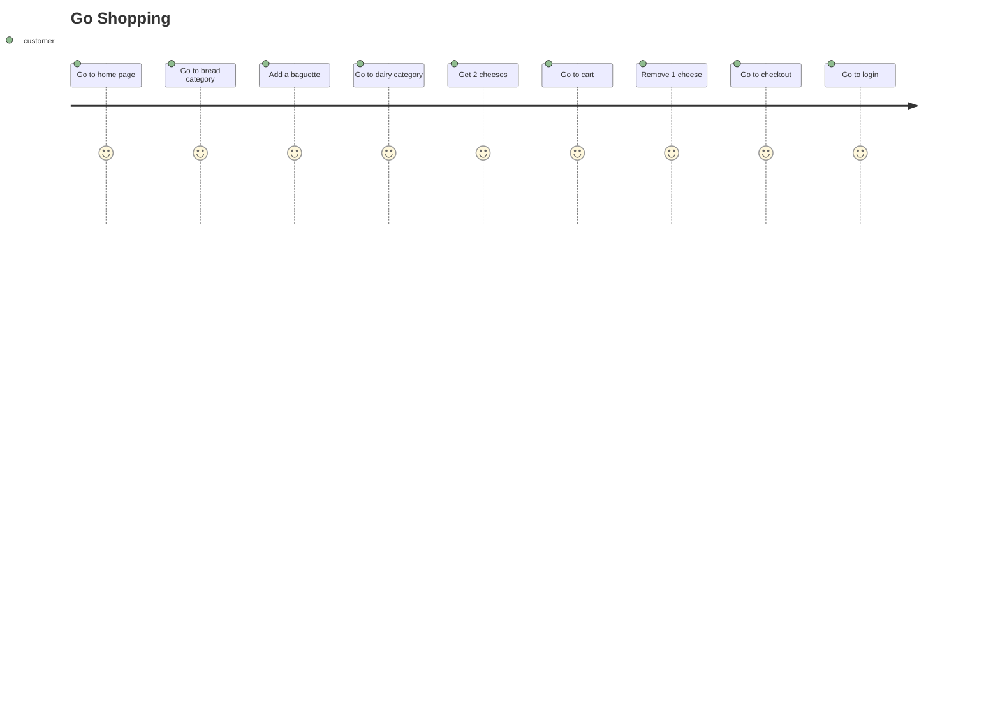

# Page Object Model Learnings

Why use the page object model? Because it makes the tests look pretty. 

Where it started:
```java
package com.sintutu.organicshopuitests;

import static org.junit.jupiter.api.Assertions.assertEquals;

import java.net.URISyntaxException;
import java.net.URL;
import java.nio.file.Paths;
import java.time.Duration;

import org.junit.jupiter.api.Test;
import org.openqa.selenium.By;
import org.openqa.selenium.WebDriver;
import org.openqa.selenium.WebElement;
import org.openqa.selenium.chrome.ChromeDriver;
import org.openqa.selenium.support.ui.ExpectedConditions;
import org.openqa.selenium.support.ui.WebDriverWait;

/**
 * ## What to test

Add an end to end test performing the following:
 
1. Select the Bread Category
2. Assert that the URL has changed
3. Add a French Baguette
4. Select the Dairy Category
5. Assert that the URL has changed
6. Add 2 blocks of cheese
7. Open the cart
8. Assert that the URL has changed
9. Remove one block of cheese
10. Click checkout
11. Click Login
 */
public class EndToEndTests {
    @Test
    public void endToEndTestShouldSucceed() throws URISyntaxException {
        // Set the path to chromedriver
        URL resource = getClass().getClassLoader().getResource("drivers/chromedriver.exe");
        if (resource != null) {
            System.setProperty("webdriver.chrome.driver", Paths.get(resource.toURI()).toString());
        }
        //Create the WebDriver 
        WebDriver driver = new ChromeDriver();

        //Navigate to home page
        driver.get("https://agular-test-shop-cb70d.firebaseapp.com");
        String currentUrl = driver.getCurrentUrl();
        assertEquals("https://agular-test-shop-cb70d.firebaseapp.com/", currentUrl);

        //1. Select the Bread Category
        WebDriverWait wait = new WebDriverWait(driver, Duration.ofSeconds(10));
        WebElement breadLink = wait.until(ExpectedConditions.presenceOfElementLocated(By.linkText("Bread")));
        breadLink.click();

        //2. Assert that the URL has changed
        currentUrl = driver.getCurrentUrl();
        assertEquals("https://agular-test-shop-cb70d.firebaseapp.com/?category=bread", currentUrl);

        //3. Add a French Baguette
        WebElement addToCartFreshFrenchBaguette 
        = wait.until(ExpectedConditions.presenceOfElementLocated(
            By.xpath(
                "//product-card[.//h5[contains(text(), 'Fresh French Baguette')]]//button[contains(text(), 'Add to Cart')]"
                )));
        addToCartFreshFrenchBaguette.click();

        // 4. Select the Dairy Category
        WebElement dairyLink = wait.until(ExpectedConditions.presenceOfElementLocated(By.linkText("Dairy")));
        dairyLink.click();
        
        // 5. Assert that the URL has changed
        currentUrl = driver.getCurrentUrl();
        assertEquals("https://agular-test-shop-cb70d.firebaseapp.com/?category=dairy", currentUrl);

        // 6. Add 2 blocks of cheese
        WebElement addToCartCheese 
        = wait.until(ExpectedConditions.presenceOfElementLocated(
            By.xpath(
                "//product-card[.//h5[contains(text(), 'Cheese')]]//button[contains(text(), 'Add to Cart')]"
                )));
        addToCartCheese.click();

        WebElement addOneMoreToCartCheese
        = wait.until(ExpectedConditions.presenceOfElementLocated(
            By.xpath(
                "//product-card[.//h5[contains(text(), 'Cheese')]]//button[contains(text(), '+')]"
                )));
        addOneMoreToCartCheese.click();

        // 7. Open the cart
        WebElement shoppingCartLink = wait.until(ExpectedConditions.presenceOfElementLocated(By.partialLinkText("Shopping Cart")));
        shoppingCartLink.click();

        // 8. Assert that the URL has changed
        currentUrl = driver.getCurrentUrl();
        assertEquals("https://agular-test-shop-cb70d.firebaseapp.com/shopping-cart", currentUrl);        

        // 9. Remove one block of cheese
        WebElement removeOneMoreFromCartCheese
        = wait.until(ExpectedConditions.presenceOfElementLocated(
            By.xpath(
"//table//tr[td[normalize-space(text()) = 'Cheese']]//button[normalize-space(text()) = '-']"                )));
        removeOneMoreFromCartCheese.click();

        // 10. Click checkout
        WebElement checkOutLink = wait.until(ExpectedConditions.presenceOfElementLocated(By.partialLinkText("Check Out")));
        checkOutLink.click();

        // 11. Click Login
        WebElement loginLink = wait.until(ExpectedConditions.presenceOfElementLocated(By.linkText("Login")));
        loginLink.click();

        //Drop the driver
        driver.quit();
    }
}
```

Where it is now:

```java
package com.sintutu.organicshopuitests;

import org.junit.jupiter.api.Test;
import com.sintutu.organicshopuitests.utils.TestBase;

/**
 * ## What to test

Add an end to end test performing the following:
 
1. Select the Bread Category
2. Assert that the URL has changed
3. Add a French Baguette
4. Select the Dairy Category
5. Assert that the URL has changed
6. Add 2 blocks of cheese
7. Open the cart
8. Assert that the URL has changed
9. Remove one block of cheese
10. Click checkout
11. Click Login
 */
public class EndToEndTests extends TestBase {
    @Test
    public void endToEndTestShouldSucceed(){

        //Navigate to home page
        homePage.load();
        homePage.assertHomePageIsLoaded();

        //1. Select the Bread Category
        homePage.clickBreadLink();

        //2. Assert that the URL has changed
        breadPage.assertBreadCategoryIsLoaded();

        //3. Add a French Baguette
        breadPage.addFrenchBaguetteToCart();

        // 4. Select the Dairy Category
        homePage.clickDairyLink();

        // 5. Assert that the URL has changed
        dairyPage.assertDairyCategoryIsLoaded();

        // 6. Add 2 blocks of cheese
        dairyPage.addCheeseToCart();
        dairyPage.incrementCheeseInCart();

        // 7. Open the cart
        clickShoppingCartLink();

        // 8. Assert that the URL has changed
        shoppingCartPage.assertShopppingCartPageIsLoaded();

        // 9. Remove one block of cheese
        shoppingCartPage.decrementCheeseFromCart();

        // 10. Click checkout
        shoppingCartPage.goToCheckOut();
        loginPage.assertLoginPageIsLoadedViaCheckout();

        // 11. Click Login
        clickLoginLink();
        loginPage.assertLoginPageIsLoaded();
    }
}
```

EndToEndTests.java looks so elegant. 

## Tests focus on user journey

It reads like someone is opening up Google Chrome and going shopping.



These tests say pretty much what's in that journey. **These tests don't show how this journey is implemented.** 

The home page is abstracted into a `homepage` object. The type isn't visible in the tests. The test does reveal the ability to `load()`, check I'm on the right home page with the `assertHomePageIsLoaded()`, go to the bread category with `clickBreadLink()` and the dairy category with `clickDairyLink()`. It mimics how a human being would interact with the browser to go shopping. This abstraction allows focusing on the actions.

How `homePage` even appears comes from `EndToEndTests` inheriting from `TestBase`.

---

## Benefits of inheriting from `TestBase`

### `WebDriver` instantiated

The `WebDriver` instantiation is complicated. You need to load the `chromedriver.exe` sitting in `organicshopuitests\target\test-classes\drivers`. So you need a `URL` to locate it so `System` can register it with a key `"webdriver.chrome.driver"` and provide it at test run time. Then the `driver` can be instantiated to be a thread of chromedriver.exe running. That compication is abstracted in `setUp()`.

### `WebDriverWait` instantiated

This instantiation is rather easy. It did need the driver to exist so it was created first.

### `PageFactory` instantiated

This instantiation is also rather easy. It happens to need a WebDriver and WebDriverWait

## Dependency Injection 

The