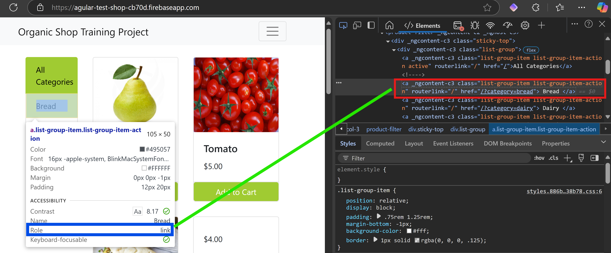
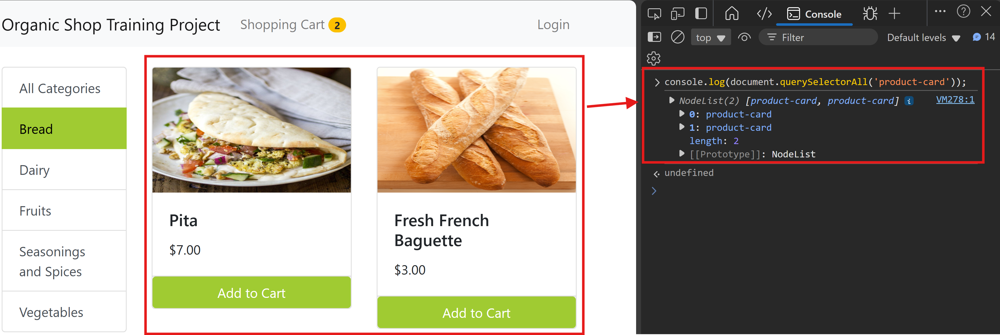
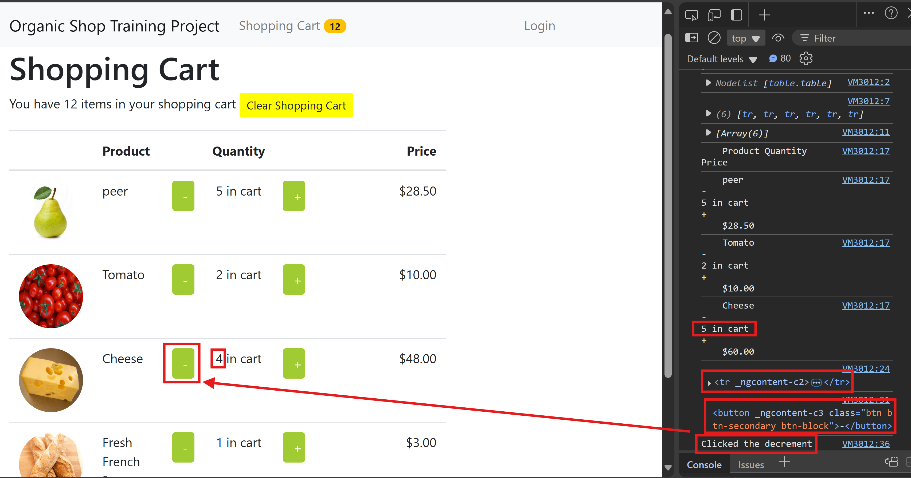
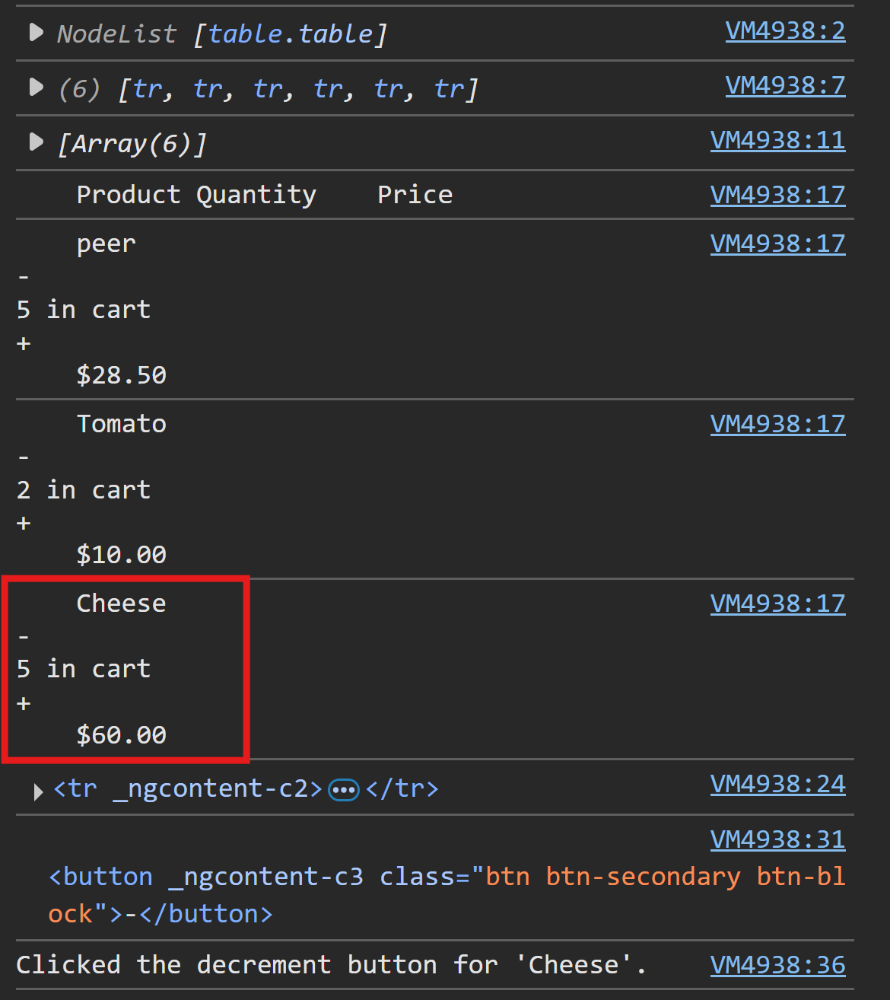
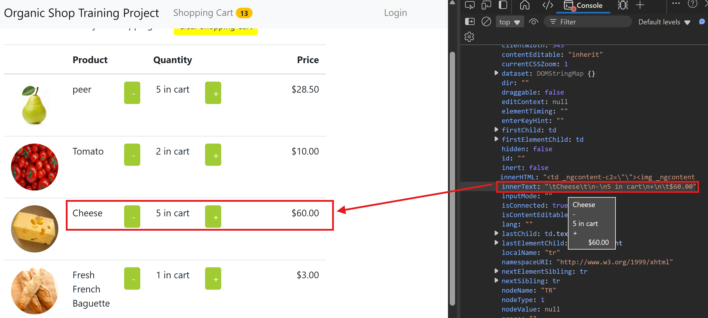

# Selenium Java Learnings

## Selenium Doesn't have access to the Accessibility Tree!

I want to click on the bread link.



The DOM shows this link as 

```html
<a _ngcontent-c3="" class="list-group-item list-group-item-action" routerlink="/" href="/?category=bread"> Bread </a>
```

Using Playwright I could access this link using [aria-role](https://github.com/sintutu/organic-shop-training-project/blob/8d6026f905b3235ed5016ef9d733029247a0e975/OrganicShopTrainingProjectPlaywrightTests/Pages/HomePage.cs#L14C9-L14C77).

Using Selenium I can't. I must use something else.

How come?

Playwright has access to the Accessibility Tree. Selenium does't. Selenium doesn't recognise implicit roles of anchor tags. :disappointed: 

[Read more in Aria Learnings...](aria-learnings.md)

If I really want accessibility testing on the page, I can use [AXE](https://github.com/dequelabs/axe-core). How? I load a page then run the AXE script on it. It scans the page for accessibility issues. Note that it's a node package so I'd need my environment to have node on it. Then I can test a page for accessibility issues somewhat more thoroughly. 

Would I want to put accessibility tests into this particular task? No. I'd probably break the flow of the test as soon as any accessibility problem was found. At a later stage I'd probably want to have accessibility tests run. Would I want it to run in this particular flow? Unsure. You see, I want to make accessibility test for each element that could possibly appear on a page's DOM. Since states of the DOM change (e.g. after selecting a tab on a page and then after the page is loaded is the tab's DOM populated) I'd want to run the same script again. It would dramatically increase the test duration. That would suck.

What's kinda great is how I learnt a Selenium weakness.

---

## Finding the `breadLink`

Sadly, it takes time for the Bread link to display.

That means this code fails because there's no link to click

```java
        WebElement breadLink = driver.findElement(By.linkText("Bread"));
```

The test run says:
```log
WARNING: Unable to find an exact match for CDP version 134, returning the closest version; found: 133; Please update to a Selenium version that supports CDP version 134
[ERROR] Tests run: 1, Failures: 0, Errors: 1, Skipped: 0, Time elapsed: 4.490 s <<< FAILURE! -- in com.sintutu.organicshopuitests.EndToEndTests
[ERROR] com.sintutu.organicshopuitests.EndToEndTests.endToEndTestShouldSucceed -- Time elapsed: 4.484 s <<< ERROR!
org.openqa.selenium.NoSuchElementException:
no such element: Unable to locate element: {"method":"link text","selector":"Bread"}
```

On the browser side, it takes a bit of time for the Bread link to even appear.

Instead, this code passes:

```java
WebDriverWait wait = new WebDriverWait(driver, Duration.ofSeconds(10));
WebElement breadLink = wait.until(ExpectedConditions.presenceOfElementLocated(By.linkText("Bread")));
``` 

What does this new code do? I tried figuring out. How can a `WebElement` be set by the `until` method? I looked at the method implementations for `until` and `presenceOfElementLocated` and needed Copilot help for the answer. Here's how it went.

> Me:
> 
> This is the implementation of `until`: 
> 
> ```java
> /**
>    * Repeatedly applies this instance's input value to the given function until one of the following
>    * occurs:
>    *
>    * <ol>
>    *   <li>the function returns neither null nor false
>    *   <li>the function throws an unignored exception
>    *   <li>the timeout expires
>    *   <li>the current thread is interrupted
>    * </ol>
>    *
>    * @param isTrue the parameter to pass to the {@link ExpectedCondition}
>    * @param <V> The function's expected return type.
>    * @return The function's return value if the function returned something different from null or
>    *     false before the timeout expired.
>    * @throws TimeoutException If the timeout expires.
>    */
>   @Override
>   public <V> V until(Function<? super T, V> isTrue) {
>     Instant end = clock.instant().plus(timeout);
> 
>     Throwable lastException;
>     while (true) {
>       try {
>         V value = isTrue.apply(input);
>         if (value != null && (Boolean.class != value.getClass() || Boolean.TRUE.equals(value))) {
>           return value;
>         }
> 
>         // Clear the last exception; if another retry or timeout exception would
>         // be caused by a false or null value, the last exception is not the
>         // cause of the timeout.
>         lastException = null;
>       } catch (Throwable e) {
>         lastException = propagateIfNotIgnored(e);
>       }
> 
>       // Check the timeout after evaluating the function to ensure conditions
>       // with a zero timeout can succeed.
>       if (end.isBefore(clock.instant())) {
>         String message = messageSupplier != null ? messageSupplier.get() : null;
> 
>         String timeoutMessage =
>             String.format(
>                 "Expected condition failed: %s (tried for %d second(s) with %d milliseconds"
>                     + " interval)",
>                 message == null ? "waiting for " + isTrue : message,
>                 timeout.getSeconds(),
>                 interval.toMillis());
>         throw timeoutException(timeoutMessage, lastException);
>       }
> 
>       try {
>         sleeper.sleep(interval);
>       } catch (InterruptedException e) {
>         Thread.currentThread().interrupt();
>         throw new WebDriverException(e);
>       }
>     }
>   }
> ``` 
> <div class="aside-box">
> Me (aside):
> 
> The confusing thing about this is how `until` returns `V`, whatever `V` the function passed in is.
></div>
><br/>
> This is the implementation of `presenceOfElementLocated`:
> 
> ```java 
> /**
>    * An expectation for checking that an element is present on the DOM of a page. This does not
>    * necessarily mean that the element is visible.
>    *
>    * @param locator used to find the element
>    * @return the WebElement once it is located
>    */
>   public static ExpectedCondition<WebElement> presenceOfElementLocated(final By locator) {
>     return new ExpectedCondition<WebElement>() {
>       @Override
>       public WebElement apply(WebDriver driver) {
>         return driver.findElement(locator);
>       }
> 
>       @Override
>       public String toString() {
>         return "presence of element located by: " + locator;
>       }
>     };
>   }
> ``` 
> <div class="aside-box">
> Me (aside):
> 
>The function passed into `until` returns an `ExpectedCondition<WebElement>`. Therefore `until` must return an `ExpectedCondition<WebElement>`. So how can the `WebElement breadLink` take on the value of `ExpectedCondition<WebElement>` when they aren't even of the same type?
> 
> That's where I get very confused.
></div>
><br/>
> 
> Here's what Copilot has to say
> 
> CoPilot:
> 
> Great observation, Sintu! Let's dive into this.
> 
>The confusion arises from the expectation that `until` would return an `ExpectedCondition<WebElement>`. Instead, it returns the result of the condition itself. Here's a detailed explanation:
> 
>1. **until Method**: The `until` method is a generic method that waits until the provided condition is met. The condition is a `Function` that takes an input (in this case, the `WebDriver` instance) and returns a value of type `V`. When the condition is met, `until` returns the value produced by the `Function`.
> 
>2. **ExpectedCondition**: `presenceOfElementLocated` is a static method that returns an instance of `ExpectedCondition<WebElement>`. This `ExpectedCondition` is a function that **applies a condition to the `WebDriver` and returns a `WebElement`** when the condition is met.
> 
> When you call `wait.until(ExpectedConditions.presenceOfElementLocated(By.linkText("Bread")))`, here's what happens step-by-step:
> 
> 1. **Condition Initialization**:
   > ```java
   > ExpectedCondition<WebElement> condition = ExpectedConditions.presenceOfElementLocated(By.linkText("Bread"));
   > ```
  > `condition` is now an `ExpectedCondition<WebElement>`. This means **it is a function that takes a `WebDriver` and returns a `WebElement`.**
> 
> 2. **Calling until Method**:
   > ```java
   > WebElement breadLink = wait.until(condition);
   > ```
   > - `wait.until(condition)` waits until the condition is met or the timeout expires.
   > - The `apply` method of `condition` is called repeatedly with the `WebDriver` instance.
   > - When `apply` returns a non-null value (a `WebElement`), `wait.until` returns that `WebElement`.
> <div class="aside-box">
> Inside `presenceOfEpresenceOfElementLocated`'s implementation there's this `apply` that says to return a `WebElement` as per the locator supplied. Inside `until`'s implementation there is an `apply` that says return what the method returned, which in this case is a `WebElement`.
></div>
><br/>
>
>The key point is that `until` doesn't return the `ExpectedCondition<WebElement>` itself. Instead, it returns the result of `apply`ing that condition, which is a `WebElement`.
> 
>In your case, `breadLink` is assigned the `WebElement` returned by `ExpectedConditions.presenceOfElementLocated(By.linkText("Bread"))`, once the condition is met within the timeout.
> 
> Here's how you can visualize it:
> 
> ```java
> Wait<WebDriver> wait = new WebDriverWait(driver, Duration.ofSeconds(2));
> ExpectedCondition<WebElement> condition = ExpectedConditions.presenceOfElementLocated(By.linkText("Bread"));
> WebElement breadLink = wait.until(condition); // breadLink is now the WebElement with link text "Bread"
> ```
> 
> I hope this clarifies things! If you need more examples or further explanation, feel free to ask.

With all that, I put it into my own words.
This code creates a new `WebDriverWait` object called  `wait`. It's instantiated with the `driver` and a duration.

This `wait`, an instance of `WebDriverWait`, has an `until` method that takes in a function as a parameter. `until` runs this function that acts as a condition. What is the condition? The function must return a truthy value within the duration, or else throw a TimeOutException when no truthy value is returned within the duration.

In this case, the function passed in is `ExpectedConditions.presenceOfElementLocated(By.linkText("Bread"))`. It uses the driver to search for the link with text, "Bread". It finds it within the duration, and returns a `WebElement`, a truthy value.

Since the condition is met, `until` will return that truthy value, the returned `WebElement`

And thus the variable `breadLink` is set to this returned value. `breadLink` is there to click.

<div class="aside-box">
On the UI side what was extraordinary is needing to increase the duration of the wait to be 10 seconds for the test to pass. I mean, 10 seconds is a very long time. Wow!
</div>
<br/>

Once found, click it with 

```java
breadlink.click();
```

Once clicked, it's easy to update `currentUrl` and assert that it is the correct one, "https://agular-test-shop-cb70d.firebaseapp.com/?category=bread", with junit's assertEquals method.

---

## Adding the French Baguette to the cart

This one was hard. While Playwright allowed for filtering, the best option found in Selenium is to use XPath.

The task is to look at all the bread products, of which there is Pita and Fresh French Baguette, and click the Add to cart button on the Fresh French Baguette.

Since XPath looks at the DOM, here's the node where the Fresh French Baguette is found:

```html
<product-card _ngcontent-c2="" _nghost-c4=""><!---->
  <div _ngcontent-c4="" class="card"><!---->
    
    <div _ngcontent-c4="" class="card-body">
      <h5 _ngcontent-c4="" class="card-title">Fresh French Baguette</h5>
      <p _ngcontent-c4="" class="card-text">$3.00</p>
    </div><!---->
    <div _ngcontent-c4="" class="card-footer"><!---->
      <button _ngcontent-c4="" class="btn btn-secondary btn-block">Add to Cart </button><!---->
    </div>
  </div>
</product-card>
```

The approach to find the xpath is to traverse the dom using javascript.

**Step 1**
Look for all `product-card` elements that *appear anywhere* on the document.

In Javascript, use:

```javascript
const productCards = document.querySelectorAll('product-card');
console.log(productCards);
```

In XPath, use
```xpath
//product-card
```

When searching the whole page, you find two It shows the `product-card`s for the Pita and the Fresh French Baguette.

.

What separates these `product-card` elements is the text inside one of the descendants. The text, "Fresh French Baguette" exists as a child of the `h5`. 

**Step 2**
Filter the `product-card` elements that have a descendent `h5` element with innerText "Fresh French Baguette".

In Javascript, use

```javascript
const filteredProductCards = Array.from(productCards)
  .filter(card => 
          card.querySelector('h5') && 
          card.querySelector('h5')
              .innerText.includes('Fresh French Baguette'));
console.log(filteredProductCards);
```

and in XPath, use

```xpath
//product-card[.//h5[contains(text(), 'Fresh French Baguette')]]
```

This is a great spot to highlight XPath's use of the `.` operator in `.//h5`. With the `.` you're telling XPath to look at only the `product-card` elements, not every `h5` tag on the page. Without the `.`, i.e. with `//h5` you'd get every `h5` element on the page.

**Step 3**
Now that the correct `product-card` is found, you look for the `button` element with inner text "Add to Cart".

With Javascript, use

```javascript
const addToCartButtons = filteredProductCards
  .map(card => 
       Array.from(card.querySelectorAll('button'))
       .find(button => 
             button.innerText.includes('Add to Cart')))
  .filter(button => button !== undefined);
console.log(addToCartButtons);
```

and with XPath, use

```xpath
//product-card[.//h5[contains(text(), 'Fresh French Baguette')]]//button[contains(text(), 'Add to Cart')]
```

Note how in javascript there's the possibility to also remove any buttons that are undefined. That doesn't exist in XPath.

And that's how you locate the Add to Cart button on the right product.

It's also how you locate the + button.

---

## Removing a block of cheese

Take a similar approach. This time it's traversing a table which is defined by

```html
<table _ngcontent-c6="" class="table">
    <thead _ngcontent-c6="">
    <tr _ngcontent-c6="">
        <th _ngcontent-c6=""></th>
        <th _ngcontent-c6="">Product</th>
        <th _ngcontent-c6="" class="text-center" style="width: 230px">Quantity</th>
        <th _ngcontent-c6="" class="text-right" style="width: 200px">Price</th>
    </tr>
    </thead>
    <tbody _ngcontent-c6=""><!---->
    <tr _ngcontent-c6="">
        <td _ngcontent-c6="">
        </td>
        <td _ngcontent-c6=""> Cheese </td>
        <td _ngcontent-c6="">
        <product-quantity _ngcontent-c6="" _nghost-c5="">
            <div _ngcontent-c5="" class="row no-gutters">
            <div _ngcontent-c5="" class="col-2">
                <button _ngcontent-c5="" class="btn btn-secondary btn-block">-</button>
            </div>
            <div _ngcontent-c5="" class="col text-center"> 2 in cart </div>
            <div _ngcontent-c5="" class="col-2">
                <button _ngcontent-c5="" class="btn btn-secondary btn-block">+</button>
            </div>
            </div>
        </product-quantity>
        </td>
        <td _ngcontent-c6="" class="text-right"> $24.00 </td>
    </tr>
    </tbody>
    <tfoot _ngcontent-c6="">
    <tr _ngcontent-c6="">
        <th _ngcontent-c6=""></th>
        <th _ngcontent-c6=""></th>
        <th _ngcontent-c6=""></th>
        <th _ngcontent-c6="" class="text-right"> $24.00 </th>
    </tr>
    </tfoot>
</table>
```

**Step 1**
First find the `table` elements. 

To do this is a matter of searching the whole document for every table element. *Since this page only has the one table this is fine. The Cheese is in this one table.*

Do this in Javascript with

```javascript
const tables = document.querySelectorAll('table');
console.log(tables); // This will log all tables on the page
```

Do this in XPath with

```xpath
//table
```

**Step 2**
Find that `tr` element that contains `td` element with innerText " Cheese ".

Below is the table row containing cheese
```html
<tr _ngcontent-c2="">
  <td _ngcontent-c2="">
  </td>
  <td _ngcontent-c2=""> Cheese </td>
  <td _ngcontent-c2="">
    <product-quantity _ngcontent-c2="" _nghost-c3="">
      <div _ngcontent-c3="" class="row no-gutters">
        <div _ngcontent-c3="" class="col-2">
          <button _ngcontent-c3="" class="btn btn-secondary btn-block">-</button>
        </div>
      <div _ngcontent-c3="" class="col text-center"> 5 in cart 
      </div>
      <div _ngcontent-c3="" class="col-2">
        <button _ngcontent-c3="" class="btn btn-secondary btn-block">+</button>
      </div>
    </div>
  </product-quantity>
  </td>
  <td _ngcontent-c2="" class="text-right"> $60.00 </td>
</tr>
```

The image below shows what we are looking for. When the page is found there were 5 units of cheese till the - button was found, clicked, and now4 units remain.


There are two Javascript approaches to find this `tr` element.

***The nested array approach***
 Since the assumption is that there are multiple possible tables, create a 3D array where

 1. the outermost array is of all `table` elements on the document
 2. and the middle array is of `tr` elements from each table on the document 
 3. and the inner array is of `td` elements in the `tr` elements. 
 4. Make the outermost loop go over the array of `table` elements.
 5. Make the middle loop go through the array of `tr` elements. 
 6. In this innermost loop create an array of `td` elements inside the `tr` element in context, and search this array of `td` elements for a `td` element with innerText " Cheese ".

This approach in Javascript is done by

```javascript
const tables = document.querySelectorAll('table');
console.log(tables); // Logs all tables on the page

// Create a nested array of rows for each table
const tableRows = Array.from(tables)
  .map(table => {
       const rows = Array.from(table.querySelectorAll('tr'));
       console.log(rows); // Log all rows in this table
       return rows;});

console.log(tableRows); // Logs the nested array of rows for each table

// Find the row containing "Cheese" in the nested structure
let cheeseRow;
for (const rows of tableRows) { // Iterate through each table's rows
  cheeseRow = rows
    .find(row => {
          console.log(row.innerText); // Log each row's text content
          return Array.from(row.querySelectorAll('td'))
            .some(td => td.innerText.trim() === 'Cheese'); // Match row with exact "Cheese" text
    });
    if (cheeseRow) break; // Stop searching once the row is found
}
console.log(cheeseRow); // Logs the row containing "Cheese" (or undefined if not found)

// Find the decrement button within the matched row
if (cheeseRow) {
    const decrementButton = Array.from(cheeseRow.querySelectorAll('button')).find(button =>
        button.innerText === '-' // Ensures we only get the "decrement" button
    );
    console.log(decrementButton); // Logs the `-` button
}
```

Something special about printing a table row with `console.log(tableRows)` is that it prints all the text in the row. That's because it prints the innerText of the `<tr>` element, which is the text of all the children in the order the text appears.


The console gets printouts look like


and digging into the table row shows you how this `<tr>` element really does have that content as innerText


In XPath, use

```xpath
//table//tr[td[normalize-space(text()) = 'Cheese']]
```

***The flatmap approach***
This approach produces a 1D array from higher dimensional arrays. 
1. Make an empty 1D array of `flatRow`
2. Make an outer array of `table` elements on the document (of which there is only one `table` element) 
3. Make an inner array populated carefully by
    1.  Making an array of `tr` elements that have `td` elements whose trimmed innerText is "Cheese". 
    2. Add (or `map`) these elements to the `flatRow` array.
    3. There shouldn't be multiple rows which satisfy these criteria, but if they are there, they still get added.
4. Return the first element of`flatRow` array as the desired `tr` element.

In Javascript this approach is done by

```javascript
const tables = document.querySelectorAll('table');
console.log(tables); // Logs all tables on the page

const flatRow = Array.from(tables)
  .flatMap(table =>
           Array.from(table.querySelectorAll('tr'))
           .find(row =>
                 Array.from(row.querySelectorAll('td'))
           .some(td => td.innerText.trim() === 'Cheese'))
  ); 
console.log(flatRow); // Returns array of all `<td>` elements where some element has innerText.trim() === 'Cheese'
const cheeseRow = flatRow[0]; // get the first matching row
console.log(cheeseRow); // Logs the row containing "Cheese"

// Find the decrement button within the matched row
const decrementButton = cheeseRow
  ? Array.from(cheeseRow.querySelectorAll('button'))
    .find(button => button.innerText === '-')
  : undefined;

console.log(decrementButton); // Logs the `-` button

// Click the decrement button if found
if (decrementButton) {
  decrementButton.click();
  console.log("Clicked the decrement button for 'Cheese'.");
} else {
  console.log("Decrement button not found.");
}
```

The XPath for this is

```xpath
//table//tr[td[normalize-space(text()) = 'Cheese']][0]
```


**Step 3**
Find the `button` element with innerText "-".

This approach

In Javascript that's 

```javascript
const tables = document.querySelectorAll('table');
console.log(tables); // Logs all tables on the page

// Create a nested array of rows for each table
const tableRows = Array.from(tables)
  .map(table => {
       const rows = Array.from(table.querySelectorAll('tr'));
       console.log(rows); // Log all rows in this table
       return rows;});

console.log(tableRows); // Logs the nested array of rows for each table

// Find the row containing "Cheese" in the nested structure
let cheeseRow;
for (const rows of tableRows) { // Iterate through each table's rows
  cheeseRow = rows
    .find(row => {
          console.log(row.innerText); // Log each row's text content
          return Array.from(row.querySelectorAll('td'))
            .some(td => td.innerText.trim() === 'Cheese'); // Match row with exact "Cheese" text
    });
    if (cheeseRow) break; // Stop searching once the row is found
}
console.log(cheeseRow); // Logs the row containing "Cheese" (or undefined if not found)

// Find the decrement button within the matched row
if (cheeseRow) {
  const decrementButton = Array.from(cheeseRow.querySelectorAll('button'))
  .find(button =>
        button.innerText === '-' // Ensures we only get the "decrement" button
  );
  console.log(decrementButton); // Logs the `-` button
}
```

or 

```javascript
const tables = document.querySelectorAll('table');
console.log(tables); // Logs all tables on the page

const flatRow = Array.from(tables)
  .flatMap(table =>
           Array.from(table.querySelectorAll('tr'))
           .find(row =>
                 Array.from(row.querySelectorAll('td'))
           .some(td => td.innerText.trim() === 'Cheese'))
  ); 
console.log(flatRow); // Returns array of all `<td>` elements where some element has innerText.trim() === 'Cheese'
const cheeseRow = flatRow[0]; // get the first matching row
console.log(cheeseRow); // Logs the row containing "Cheese"

// Find the decrement button within the matched row
const decrementButton = cheeseRow
  ? Array.from(cheeseRow.querySelectorAll('button'))
    .find(button => button.innerText === '-')
  : undefined;

console.log(decrementButton); // Logs the `-` button
```

and in XPath it's

```xpath
//table//tr[td[normalize-space(text()) = 'Cheese']]//button[text() = '-']
```
